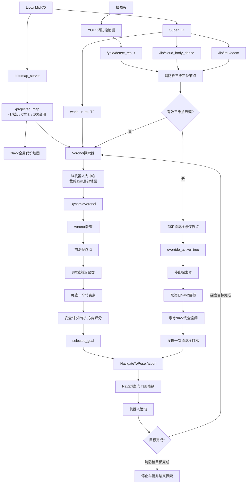
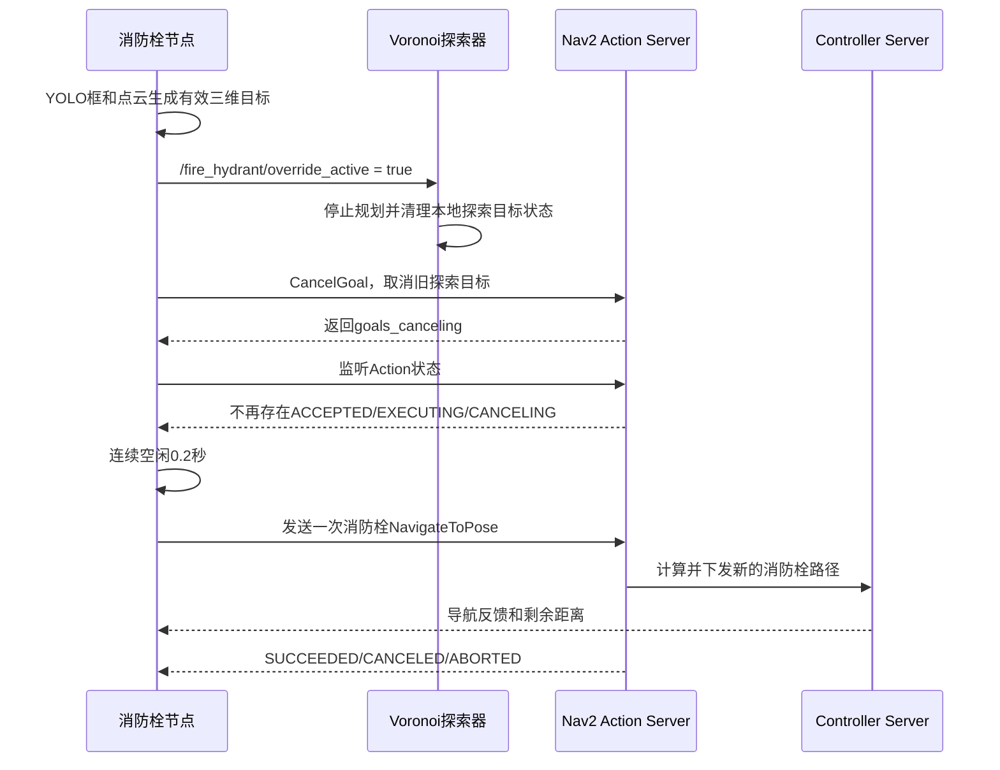

# 未知环境探索与消防栓检测接管导航机制

## 1. 总体架构

当前系统由三套独立运行、通过 ROS 2 话题和 Nav2 Action 协作的模块组成：

1. Nav2、SuperLIO、OctoMap：负责定位、建图、路径规划和车辆控制。
2. Voronoi 探索器：持续生成未知环境的前沿导航点。
3. 消防栓检测接管节点：检测到有效消防栓后停止探索，并取得导航控制权。



## 2. 建图和定位

SuperLIO提供以下主要数据：

- `/lio/imu/odom`：机器人在世界坐标系中的位姿和速度。
- `world -> imu` TF：供Nav2和探索器查询机器人位姿。
- `/lio/cloud_body_dense`：当前帧去畸变稠密点云，供消防栓三维定位使用。

当前实机启动文件中的`octomap_server`实际订阅`/livox/lidar`，通过TF将点云转换到`world`，构建三维OctoMap并发布二维投影地图`/projected_map`。

投影地图的主要栅格含义为：

- `-1`：未知区域。
- `0`：已知空闲区域。
- `100`：占用区域或障碍物。

探索器配置的`occupied_threshold: 50`表示数值大于等于50时判定为障碍物。当前实现只将数值恰好为0的栅格判定为空闲，1至49会按未知处理。

## 3. Voronoi未知环境探索

探索器订阅`/projected_map`，并以`1.0s`周期执行规划和目标复检。

### 3.1 局部地图裁剪

1. 通过TF获取`map -> imu`机器人位姿。
2. 以机器人为中心裁剪`search_radius: 12.0m`的局部地图。
3. 当`treat_outside_map_as_unknown: true`时，裁剪范围内超出真实地图边界的部分补为unknown。
4. 补出的unknown只用于产生边界前沿，导航目标仍必须位于真实地图内部的free栅格。

### 3.2 DynamicVoronoi骨架

1. occupied栅格作为Voronoi障碍物。
2. 当`unknown_is_voronoi_obstacle: true`时，unknown也作为Voronoi边界。
3. DynamicVoronoi在自由空间中生成到障碍边界等距的中轴骨架。
4. RViz中的蓝色点是用于调试显示的Voronoi skeleton点。

### 3.3 前沿候选点筛选

只有满足以下条件的骨架点才能成为原始前沿候选点：

- 位于真实`/projected_map`内部。
- 当前栅格是free。
- 距离机器人位于`min_goal_distance`和`max_goal_distance`之间。
- 不在历史黑名单范围内。
- 周围`min_clearance`范围内没有occupied栅格。
- 机器人到候选点的直线路径没有被occupied栅格阻断。
- 在`unknown_search_radius`范围内至少看到`min_frontier_unknown_cells`个可见unknown栅格。
- 被墙壁或障碍物遮挡的unknown不计入可见unknown数量。

候选点yaw由周围可见unknown的平均方向计算，因此前沿姿态始终朝向未知区域，而不是强制等于车体姿态。

### 3.4 前沿聚类和代表点

原始候选点按照栅格8邻域进行BFS连通聚类。只要候选点之间能够通过连续相邻点连接，就属于同一个前沿簇。

当`use_cluster_centroid: true`时：

1. 计算簇内所有候选点的几何中心。
2. 不直接使用可能落在非安全区域的数学中心。
3. 从簇内真实候选点中选择距离几何中心最近的点作为代表点。

`/voronoi_explorer/frontiers`发布的是每个有效前沿簇的代表点，而不是所有原始候选点。

### 3.5 最终导航目标评分

原始候选点基础评分：

```text
frontier_score =
    information_weight * log1p(unknown_count)
  + clearance_weight * clearance
  - distance_weight * distance
```

加入车体姿态软偏好后的最终评分：

```text
score =
    frontier_score
  + forward_weight * forward_alignment
  + heading_alignment_weight * heading_alignment
```

当前主要权重为：

- `information_weight: 1.0`：奖励可见未知信息量。
- `clearance_weight: 0.7`：奖励远离障碍物。
- `distance_weight: 0.0`：当前不惩罚远目标。
- `forward_weight: 3.0`：明显偏好位于车头前方的目标位置。
- `heading_alignment_weight: 0.8`：奖励前沿yaw与车体yaw接近。

聚类代表点还会使用整个簇的unknown数量总和，并增加`0.05 * cluster_size`的簇规模奖励。

### 3.6 探索目标发布和执行

- `/voronoi_explorer/frontiers`：所有前沿代表点。
- `/voronoi_explorer/selected_goal`：当前最高分目标，用于RViz显示。
- `navigate_to_pose`：真正驱动Nav2的Action目标。

当`send_nav_goals: false`时，探索器仍计算和发布可视化结果，但不会向Nav2发送目标，适合调试。

导航期间持续执行以下检查：

- 距离目标小于`goal_reached_radius: 0.6m`：结束当前目标并选择下一个目标。
- 当前目标超出地图、变成非free栅格或附近出现障碍物：取消并重新规划。
- 机器人到目标的栅格直线之间出现障碍物：取消并重新规划。
- 执行超过`goal_timeout: 45s`：取消并加入黑名单。
- Nav2返回失败：加入黑名单，避免立即重复选择。
- 没有可用前沿点：保持等待地图更新，不会立即宣布探索完成。

## 4. 消防栓检测和三维定位

消防栓节点同时订阅：

- `/yolo/detect_result`：YOLO二维检测框。
- `/lio/cloud_body_dense`：当前帧去畸变稠密点云。
- `/lio/imu/odom`：机器人世界坐标位姿。

只有二维检测框不会触发导航接管，还必须成功得到有效的三维点云簇。

三维定位过程如下：

1. 使用标定后的相机内参和雷达到相机外参，将点云投影到图像平面。
2. 保留投影位置落在YOLO消防栓框中的点。
3. 累积最近5帧、最大0.8秒的点云。
4. 使用`voxel_size: 0.05m`进行体素降采样。
5. 使用`cluster_tolerance: 0.15m`进行欧式聚类。
6. 过滤点数小于`min_cluster_points: 8`的簇。
7. 过滤尺寸超过`[1.0, 1.0, 0.7]m`的簇。
8. 在有效簇中选择点数最多的簇。
9. 使用该簇点云均值作为消防栓三维中心。

当前算法尚未加入专门的前景深度筛选，因此当YOLO框同时覆盖消防栓、墙面和地面时，仍可能选到较大的背景簇。

## 5. 消防栓停靠目标

得到消防栓中心后，在机器人与消防栓的连线上计算停靠目标：

```text
goal = robot + normalize(hydrant - robot) * (distance - stand_off_distance)
```

当前`stand_off_distance: 1.5m`，机器人不会直接导航到消防栓中心，而是停在消防栓前方约1.5米处。目标yaw始终朝向消防栓。

当前`realtime_update_goal: false`，首次有效三维检测后锁定消防栓和停靠点，避免导航过程中因点云抖动反复抢占Nav2。

## 6. 消防栓接管Nav2

普通探索阶段，Voronoi探索器拥有导航目标生成权。消防栓接管阶段，消防栓节点具有更高业务优先级。



采用“取消后等待空闲再发送”的原因是：CancelGoal响应只表示Nav2接受了取消请求，并不代表旧行为树和`FollowPath`已经完全退出。若立即发送新目标，自定义行为树可能继续执行旧探索路径，并把旧目标到达误报为消防栓目标成功。

## 7. 消防栓导航结果保护

消防栓目标发送后：

- 每秒打印Nav2反馈中的当前位置和剩余距离。
- Action被取消或失败时，保持override激活，并按`nav_goal_retry_period`重试。
- Nav2返回成功时，使用`/lio/imu/odom`再次计算机器人到消防栓停靠点的距离。
- 若Nav2报告成功但里程计距离仍超过`nav_success_validation_distance: 0.5m`，判定为旧路径误报，保持接管并重新发送目标。
- 距离停靠点小于`goal_reach_threshold: 0.3m`时，也可直接判定任务完成。
- 距离消防栓中心小于`min_hydrant_distance: 0.6m`时，为保持安全距离会停止导航。

## 8. 任务完成

确认到达消防栓停靠点后，消防栓节点发布：

- `/stop_exploring = true`
- `/stop = 2`
- `/fire_hydrant/mission_complete = true`
- `/fire_hydrant/override_active = false`

虽然override最终恢复为false，但探索器已经被`/stop_exploring`置为停止状态，因此不会自动恢复未知环境探索。

## 9. 独立启动方式

Nav2与OctoMap：

```bash
ros2 launch realrobot_nav2 nav2_realbot_tebpluswithoutmap.launch.py
```

Voronoi自主探索：

```bash
ros2 launch nav2_voronoi_explorer voronoi_explorer.launch.py send_nav_goals:=true
```

只调试Voronoi和前沿点，不向Nav2发送目标：

```bash
ros2 launch nav2_voronoi_explorer voronoi_explorer.launch.py send_nav_goals:=false
```

消防栓三维定位和接管：

```bash
ros2 launch fire_hydrant_target fire_hydrant_target.launch.py \
  point_cloud_topic:=/lio/cloud_body_dense \
  odom_topic:=/lio/imu/odom \
  stand_off_distance:=1.5
```

YOLO相机检测节点需要另外启动，并保证发布`/yolo/detect_result`。

## 10. 主要源码和配置

- `src/realrobot_nav2/launch/nav2_realbot_tebpluswithoutmap.launch.py`
- `src/nav2_voronoi_explorer/src/voronoi_frontier_explorer.cpp`
- `src/nav2_voronoi_explorer/config/voronoi_explorer.yaml`
- `src/fire_hydrant_target/fire_hydrant_target/fire_hydrant_target_node.py`
- `src/fire_hydrant_target/config/fire_hydrant_target.yaml`
- `src/yolo_fire_detector/yolo_fire_detector/gstreamer_yolo_node.py`
